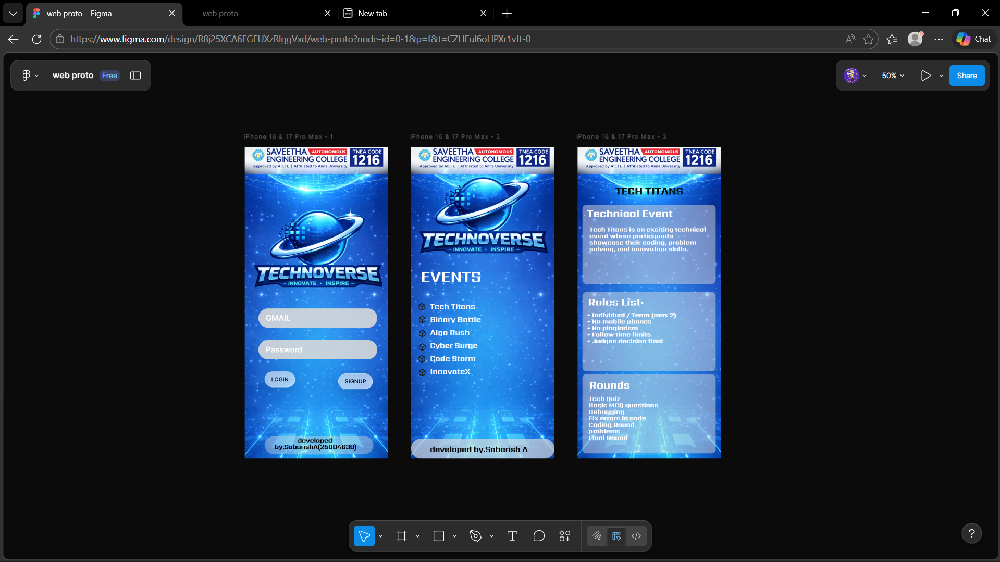

# Ex08 Event Registration Web Application
## Date:20.3.2026

## AIM:
To design, develop and deploy a web application for event registration using Figma UI tool.

## UI DESIGN TOOL:
Figma

## DESIGN STEPS:

### Step 1:
Use frames to represent screens or sections.

### Step 2:
Add column grids for consistent spacing and alignment.

### Step 3:
Insert shapes, text, buttons, and icons.

### Step 4:
Use Auto Layout for flexible, responsive design.

### Step 5:
Define color, text, and effect styles globally for consistency.

### Step 6:
Name layers logically and group related elements.

### Step 6:
Link frames to show navigation or interactions.

### Step 7:
Select the specific frame while generating code using Anima plugin.

## CODE:

```
HOME PAGE 

index.html
<!DOCTYPE html>
<html>
  <head>
    <meta name="viewport" content="width=device-width, initial-scale=1" />
    <meta charset="utf-8" />
    <link rel="stylesheet" href="globals.css" />
    <link rel="stylesheet" href="styleguide.css" />
    <link rel="stylesheet" href="style.css" />
  </head>
  <body>
    <div class="iphone-pro-max">
      
      
      
      
      
      <div class="text-wrapper">Password</div>
      <div class="div">GMAIL</div>
      <div class="rectangle-2"></div>
      <div class="developed-by">
        &nbsp;&nbsp;&nbsp;&nbsp;&nbsp;&nbsp;&nbsp;&nbsp;&nbsp;&nbsp;&nbsp;&nbsp;&nbsp;&nbsp;developed
        by.SabarishA(25004630)
      </div>
      <button class="button-liquid-glass">
        <div class="BG"><div class="glass-effect"></div></div>
        <div class="text"><div class="symbol">LOGIN</div></div>
      </button>
      <div class="button-liquid-glass-2">
        <div class="BG"><div class="glass-effect"></div></div>
        <div class="text"><div class="symbol">SIGNUP</div></div>
      </div>
    </div>
  </body>
</html>

globals.css

@import url("https://cdnjs.cloudflare.com/ajax/libs/meyer-reset/2.0/reset.min.css");
* {
  -webkit-font-smoothing: antialiased;
  box-sizing: border-box;
}
html,
body {
  margin: 0px;
  height: 100%;
}
/* a blue color as a generic focus style */
button:focus-visible {
  outline: 2px solid #4a90e2 !important;
  outline: -webkit-focus-ring-color auto 5px !important;
}
a {
  text-decoration: none;
}
/* @FONTWARNING[{"type": "restricted", "family": "Inter-SemiBold", "weight": "600", "style": "normal", "allowsCrossOrigin": false}] */

@font-face {
  font-family: "Inter-SemiBold";
  src: local("Inter-SemiBold");
}
/* @FONTWARNING[{"type": "restricted", "family": "Sarpanch-Bold", "weight": "700", "style": "normal", "allowsCrossOrigin": false}] */

@font-face {
  font-family: "Sarpanch-Bold";
  src: local("Sarpanch-Bold");
}
/* @FONTWARNING[{"type": "restricted", "family": "SF Pro-Medium", "weight": "500", "style": "normal", "allowsCrossOrigin": false}] */

@font-face {
  font-family: "SF Pro-Medium";
  src: local("SF Pro-Medium");
}

style.css

.iphone-pro-max {
  background-color: #ffffff;
  width: 100%;
  min-width: 440px;
  min-height: 956px;
  position: relative;
}

.iphone-pro-max .chatgpt-image-mar {
  height: 956px;
  aspect-ratio: 0.56;
  position: absolute;
  top: 0;
  left: 0;
  width: 440px;
}

.iphone-pro-max .img {
  height: 82px;
  aspect-ratio: 5.49;
  position: absolute;
  top: 0;
  left: 0;
  width: 440px;
}

.iphone-pro-max .image-removebg {
  position: absolute;
  top: 145px;
  left: 0;
  width: 423px;
  height: 365px;
  aspect-ratio: 1.21;
}

.iphone-pro-max .vector {
  position: absolute;
  top: 495px;
  left: 42px;
  width: 365px;
  height: 60px;
}

.iphone-pro-max .rectangle {
  position: absolute;
  top: 592px;
  left: 42px;
  width: 365px;
  height: 60px;
}

.iphone-pro-max .text-wrapper {
  position: absolute;
  top: 602px;
  left: 64px;
  width: 276px;
  height: 39px;
  display: flex;
  align-items: center;
  font-family: "Inter-SemiBold", Helvetica;
  font-weight: 600;
  color: #ffffff;
  font-size: 24px;
  letter-spacing: 0;
  line-height: normal;
}

.iphone-pro-max .div {
  position: absolute;
  top: 505px;
  left: 64px;
  width: 276px;
  height: 39px;
  display: flex;
  align-items: center;
  font-family: "Inter-SemiBold", Helvetica;
  font-weight: 600;
  color: #ffffff;
  font-size: 24px;
  letter-spacing: 0;
  line-height: normal;
}

.iphone-pro-max .rectangle-2 {
  position: absolute;
  top: 888px;
  left: 61px;
  width: 334px;
  height: 54px;
  background-color: #d9d9d9;
  border-radius: 65px;
  opacity: 0.4;
}

.iphone-pro-max .developed-by {
  position: absolute;
  top: 888px;
  left: 92px;
  width: 265px;
  height: 44px;
  display: flex;
  align-items: center;
  font-family: "Sarpanch-Bold", Helvetica;
  font-weight: 700;
  color: #000000;
  font-size: 20px;
  letter-spacing: -0.43px;
  line-height: 20px;
}

.iphone-pro-max .button-liquid-glass {
  all: unset;
  box-sizing: border-box;
  display: inline-flex;
  align-items: center;
  justify-content: center;
  gap: 4px;
  padding: 6px 20px;
  position: absolute;
  top: 689px;
  left: 61px;
  border-radius: 1000px;
}

.iphone-pro-max .BG {
  position: absolute;
  width: 100%;
  height: 100%;
  top: 0;
  left: 0;
  border-radius: 296px;
  box-shadow: 0px 8px 40px #0000001f;
  background: linear-gradient(
      0deg,
      rgba(247, 247, 247, 1) 0%,
      rgba(247, 247, 247, 1) 100%
    ),
    linear-gradient(
      0deg,
      rgba(221, 221, 221, 1) 0%,
      rgba(221, 221, 221, 1) 100%
    ),
    linear-gradient(
      0deg,
      rgba(255, 255, 255, 0.65) 0%,
      rgba(255, 255, 255, 0.65) 100%
    );
}

.iphone-pro-max .glass-effect {
  height: 100%;
  background-color: #00000001;
  border-radius: 296px;
  backdrop-filter: blur(3.5px) brightness(100.0%) saturate(105.0%);
  -webkit-backdrop-filter: blur(3.5px) brightness(100.0%) saturate(105.0%);
  box-shadow:
    inset 0 1px 0 rgba(255, 255, 255, 0.4), inset 1px 0 0 rgba(
      255,
      255,
      255,
      0.32
    ), inset 0 -1px 2px rgba(0, 0, 0, 0.11), inset -1px 0 2px rgba(
      0,
      0,
      0,
      0.09
    );
}

.iphone-pro-max .text {
  display: inline-flex;
  height: 36px;
  align-items: center;
  justify-content: center;
  position: relative;
  flex: 0 0 auto;
  border-radius: 100px;
}

.iphone-pro-max .symbol {
  position: relative;
  display: flex;
  align-items: center;
  justify-content: center;
  width: fit-content;
  font-family: "SF Pro-Medium", Helvetica;
  font-weight: 500;
  color: var(--colors-labels-vibrant-controls-primary);
  font-size: 17px;
  text-align: center;
  letter-spacing: 0;
  line-height: normal;
  white-space: nowrap;
}

.iphone-pro-max .button-liquid-glass-2 {
  display: inline-flex;
  align-items: center;
  justify-content: center;
  gap: 4px;
  padding: 6px 20px;
  position: absolute;
  top: 695px;
  left: 287px;
  border-radius: 1000px;
}

styleguide.css

:root {
  --colors-labels-vibrant-controls-primary: rgba(26, 26, 26, 1);
}

/*

To enable a theme in your HTML, simply add one of the following data attributes to an HTML element, like so:

<body data-colors-mode="light">
    <!-- the rest of your content -->
</body>

You can apply the theme on any DOM node, not just the `body`

*/

[data-colors-mode="light"] {
  --colors-labels-vibrant-controls-primary: rgba(26, 26, 26, 1);
}

[data-colors-mode="dark"] {
  --colors-labels-vibrant-controls-primary: rgba(245, 245, 245, 1);
}

[data-colors-mode="IC-light"] {
  --colors-labels-vibrant-controls-primary: rgba(0, 0, 0, 1);
}

[data-colors-mode="IC-dark"] {
  --colors-labels-vibrant-controls-primary: rgba(255, 255, 255, 1);
}

EVENTS REGISTRATION PAGE 

index.html 

<!DOCTYPE html>
<html>
  <head>
    <meta name="viewport" content="width=device-width, initial-scale=1" />
    <meta charset="utf-8" />
    <link rel="stylesheet" href="globals.css" />
    <link rel="stylesheet" href="style.css" />
  </head>
  <body>
    <div class="iphone-pro-max">
      
      
      
      <div class="text-wrapper">EVENTS</div>
      <p class="tech-titans-binary">
        Tech Titans<br /><br />Binary Battle<br /><br />Algo Rush<br /><br />Cyber Surge<br /><br />Code Storm<br /><br />InnovateX
      </p>
      
      
      
      
      
      <div class="rectangle"></div>
      
      <div class="developed-by">&nbsp;&nbsp;&nbsp;&nbsp;&nbsp;&nbsp;developed by.Sabarish A</div>
    </div>
  </body>
</html>

globals.css

@import url("https://cdnjs.cloudflare.com/ajax/libs/meyer-reset/2.0/reset.min.css");
* {
  -webkit-font-smoothing: antialiased;
  box-sizing: border-box;
}
html,
body {
  margin: 0px;
  height: 100%;
}
/* a blue color as a generic focus style */
button:focus-visible {
  outline: 2px solid #4a90e2 !important;
  outline: -webkit-focus-ring-color auto 5px !important;
}
a {
  text-decoration: none;
}
/* @FONTWARNING[{"type": "restricted", "family": "Sarpanch-Bold", "weight": "700", "style": "normal", "allowsCrossOrigin": false}] */

@font-face {
  font-family: "Sarpanch-Bold";
  src: local("Sarpanch-Bold");
}


style.css

.iphone-pro-max {
  background-color: #ffffff;
  width: 100%;
  min-width: 440px;
  min-height: 956px;
  position: relative;
}

.iphone-pro-max .chatgpt-image-mar {
  height: 956px;
  aspect-ratio: 0.56;
  position: absolute;
  top: 0;
  left: 0;
  width: 440px;
}

.iphone-pro-max .img {
  height: 82px;
  aspect-ratio: 5.49;
  position: absolute;
  top: 0;
  left: 0;
  width: 440px;
}

.iphone-pro-max .image-removebg {
  position: absolute;
  top: 41px;
  left: 0;
  width: 419px;
  height: 365px;
  aspect-ratio: 1.21;
}

.iphone-pro-max .text-wrapper {
  position: absolute;
  top: 374px;
  left: 29px;
  width: 354px;
  height: 45px;
  display: flex;
  align-items: center;
  font-family: "Sarpanch-Bold", Helvetica;
  font-weight: 700;
  color: #ffffff;
  font-size: 48px;
  letter-spacing: -0.43px;
  line-height: 20px;
}

.iphone-pro-max .tech-titans-binary {
  position: absolute;
  top: 455px;
  left: 58px;
  width: 365px;
  height: 268px;
  font-family: "Sarpanch-Bold", Helvetica;
  font-weight: 700;
  color: #ffffff;
  font-size: 24px;
  letter-spacing: -0.43px;
  line-height: 20px;
}

.iphone-pro-max .box {
  position: absolute;
  top: 517px;
  left: 22px;
  width: 24px;
  height: 24px;
}

.iphone-pro-max .box-2 {
  top: 560px;
  left: 22px;
  position: absolute;
  width: 24px;
  height: 24px;
}

.iphone-pro-max .box-3 {
  top: 602px;
  left: 22px;
  position: absolute;
  width: 24px;
  height: 24px;
}

.iphone-pro-max .box-4 {
  top: 638px;
  left: 21px;
  position: absolute;
  width: 24px;
  height: 24px;
}

.iphone-pro-max .box-5 {
  top: 680px;
  left: 22px;
  position: absolute;
  width: 24px;
  height: 24px;
}

.iphone-pro-max .rectangle {
  position: absolute;
  top: 895px;
  left: 0;
  width: 440px;
  height: 61px;
  background-color: #d9d9d9;
  border-radius: 30px;
  opacity: 0.69;
}

.iphone-pro-max .box-6 {
  top: 478px;
  left: 21px;
  position: absolute;
  width: 24px;
  height: 24px;
}

.iphone-pro-max .developed-by {
  position: absolute;
  top: 899px;
  left: 21px;
  width: 389px;
  height: 57px;
  display: flex;
  align-items: center;
  font-family: "Sarpanch-Bold", Helvetica;
  font-weight: 700;
  color: #000000;
  font-size: 24px;
  letter-spacing: -0.43px;
  line-height: 20px;
}

EVENT PAGE 

index.html

<!DOCTYPE html>
<html>
  <head>
    <meta name="viewport" content="width=device-width, initial-scale=1" />
    <meta charset="utf-8" />
    <link rel="stylesheet" href="globals.css" />
    <link rel="stylesheet" href="style.css" />
  </head>
  <body>
    <div class="iphone-pro-max">
      
      
      <p class="TECH-TITANS"><span class="text-wrapper">TECH TITANS</span> <span class="span"></span></p>
      <div class="rounded-rectangle"></div>
      <div class="div"></div>
      <div class="rounded-rectangle-2"></div>
      <div class="text-wrapper-2">Technical Event</div>
      <p class="p">
        Tech Titans is an exciting technical event where participants showcase their coding, problem-solving, and
        innovation skills.
      </p>
      <div class="text-wrapper-3">Rules List:</div>
      <p class="individual-team-max">
        • Individual / Team (max 2) <br />• No mobile phones <br />• No plagiarism <br />• Follow time limits <br />•
        Judges decision final
      </p>
      <p class="tech-quiz-basic-MCQ">
        Tech Quiz<br />Basic MCQ questions<br />Debugging<br />Fix errors in code<br />Coding Round<br />problems<br />Final
        Round
      </p>
      <div class="text-wrapper-4">Rounds</div>
    </div>
  </body>
</html>


globals.css

@import url("https://cdnjs.cloudflare.com/ajax/libs/meyer-reset/2.0/reset.min.css");
* {
  -webkit-font-smoothing: antialiased;
  box-sizing: border-box;
}
html,
body {
  margin: 0px;
  height: 100%;
}
/* a blue color as a generic focus style */
button:focus-visible {
  outline: 2px solid #4a90e2 !important;
  outline: -webkit-focus-ring-color auto 5px !important;
}
a {
  text-decoration: none;
}
/* @FONTWARNING[{"type": "restricted", "family": "Sarpanch-ExtraBold", "weight": "400", "style": "normal", "allowsCrossOrigin": false}] */

@font-face {
  font-family: "Sarpanch-ExtraBold";
  src: local("Sarpanch-ExtraBold");
}
/* @FONTWARNING[{"type": "restricted", "family": "Sarpanch-Bold", "weight": "700", "style": "normal", "allowsCrossOrigin": false}] */

@font-face {
  font-family: "Sarpanch-Bold";
  src: local("Sarpanch-Bold");
}

style.css

.iphone-pro-max {
  background-color: #ffffff;
  width: 100%;
  min-width: 440px;
  min-height: 956px;
  position: relative;
}

.iphone-pro-max .chatgpt-image-mar {
  height: 956px;
  aspect-ratio: 0.56;
  position: absolute;
  top: 0;
  left: 0;
  width: 440px;
}

.iphone-pro-max .img {
  height: 82px;
  aspect-ratio: 5.49;
  position: absolute;
  top: 0;
  left: 0;
  width: 440px;
}

.iphone-pro-max .TECH-TITANS {
  position: absolute;
  top: 120px;
  left: 91px;
  width: 258px;
  height: 48px;
  display: flex;
  align-items: center;
  justify-content: center;
  font-family: "Sarpanch-ExtraBold", Helvetica;
  font-weight: 400;
  color: #00100f;
  font-size: 32px;
  text-align: center;
  letter-spacing: -0.43px;
  line-height: 20px;
}

.iphone-pro-max .text-wrapper {
  font-weight: 800;
  letter-spacing: -0.14px;
}

.iphone-pro-max .span {
  font-family: "Sarpanch-Bold", Helvetica;
  font-weight: 700;
  font-size: 24px;
  letter-spacing: -0.10px;
}

.iphone-pro-max .rounded-rectangle {
  position: absolute;
  top: 445px;
  left: 15px;
  width: 409px;
  height: 243px;
  background-color: #d9d9d9;
  border-radius: 12px;
  opacity: 0.49;
}

.iphone-pro-max .div {
  top: 697px;
  position: absolute;
  left: 15px;
  width: 409px;
  height: 243px;
  background-color: #d9d9d9;
  border-radius: 12px;
  opacity: 0.49;
}

.iphone-pro-max .rounded-rectangle-2 {
  top: 177px;
  position: absolute;
  left: 15px;
  width: 409px;
  height: 243px;
  background-color: #d9d9d9;
  border-radius: 12px;
  opacity: 0.49;
}

.iphone-pro-max .text-wrapper-2 {
  position: absolute;
  top: 197px;
  left: 17px;
  width: 287px;
  height: 11px;
  display: flex;
  align-items: center;
  justify-content: center;
  font-family: "Sarpanch-ExtraBold", Helvetica;
  font-weight: 800;
  color: #ffffff;
  font-size: 32px;
  text-align: center;
  letter-spacing: -0.43px;
  line-height: 20px;
  white-space: nowrap;
}

.iphone-pro-max .p {
  position: absolute;
  top: 197px;
  left: 36px;
  width: 367px;
  height: 169px;
  display: flex;
  align-items: center;
  font-family: "Sarpanch-ExtraBold", Helvetica;
  font-weight: 800;
  color: #ffffff;
  font-size: 20px;
  letter-spacing: -0.43px;
  line-height: 20px;
}

.iphone-pro-max .text-wrapper-3 {
  position: absolute;
  top: 461px;
  left: 32px;
  width: 302px;
  height: 27px;
  display: flex;
  align-items: center;
  font-family: "Sarpanch-ExtraBold", Helvetica;
  font-weight: 800;
  color: #ffffff;
  font-size: 32px;
  letter-spacing: -0.43px;
  line-height: 20px;
}

.iphone-pro-max .individual-team-max {
  position: absolute;
  top: 475px;
  left: 29px;
  width: 344px;
  height: 160px;
  font-family: "Sarpanch-ExtraBold", Helvetica;
  font-weight: 800;
  color: #ffffff;
  font-size: 20px;
  letter-spacing: -0.43px;
  line-height: 20px;
}

.iphone-pro-max .tech-quiz-basic-MCQ {
  position: absolute;
  top: 765px;
  left: 34px;
  width: 372px;
  height: 133px;
  font-family: "Sarpanch-ExtraBold", Helvetica;
  font-weight: 800;
  color: #ffffff;
  font-size: 20px;
  letter-spacing: -0.43px;
  line-height: 20px;
}

.iphone-pro-max .text-wrapper-4 {
  position: absolute;
  top: 713px;
  left: 36px;
  width: 329px;
  height: 33px;
  display: flex;
  align-items: center;
  font-family: "Sarpanch-ExtraBold", Helvetica;
  font-weight: 800;
  color: #ffffff;
  font-size: 32px;
  letter-spacing: -0.43px;
  line-height: 20px;
}


```

## OUTPUT:


## RESULT:
The program to design, develop and deploy a web application for event registration using Figma UI tool is completed successfully.
